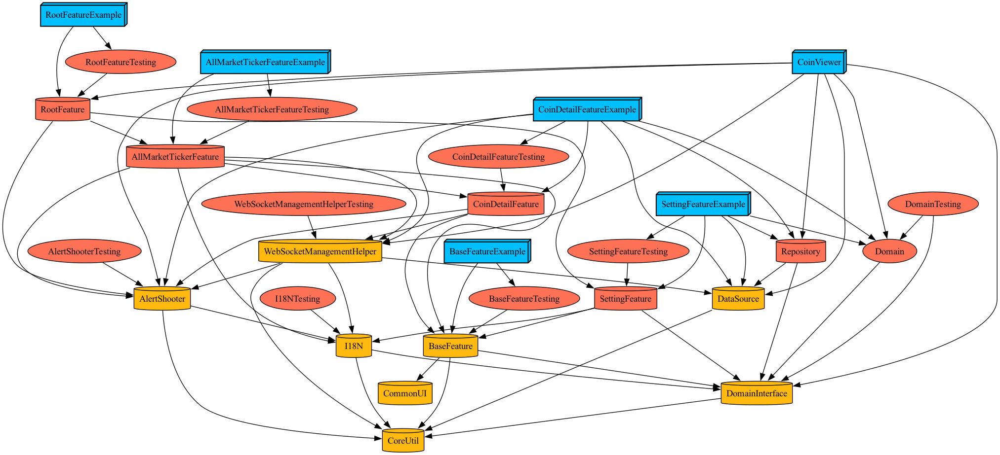

# soma-coin-viewer-ios

소프트웨어 마에스트로 15기에서, Best Practice 용도로 만든 코인뷰어 어플리케이션 입니다.

## 기능 소개

### 웹소켓 스트림

<table>
  <tr>
    <td>
      <b>실시간 코인 가격 변동</b>
    </td>
    <td>
      <b>코인 디테일 정보(오더북테이블, 채결 거래정보)</b>
    </td>
  </tr>
  <tr>
    <td>
      
    </td>
    <td>
      
    </td>
  </tr>
</table>

### UI동적 변경

<table>
  <tr>
    <td>
      <b>화폐 동적변경</b>
    </td>
    <td>
      <b>언어 동적변경</b>
    </td>
    <td>
      <b>리스트 타입 동적변경</b>
    </td>
  </tr>
  <tr>
    <td>
       
    </td>
    <td>
      
    </td>
    <td>
      
    </td>
  </tr>
</table>


## 기술 스택

<table>
    <tr>
        <td>
            <b>메인 프레임워크</b>
        </td>
        <td>
            <b>SwiftUI</b>
        </td>
    </tr>
    <tr>
        <td>
            <b>아키텍처</b>
        </td>
        <td>
            <b>클린아키텍처</b>
        </td>
    </tr>
    <tr>
        <td>
            <b>디자인 패턴</b>
        </td>
        <td>
            <b>MVVM</b>
        </td>
    </tr>
    <tr>
        <td>
            <b>외부 의존성</b>
        </td>
        <td>
            <b>Swinject, SimpleImageProvider(자체구현 라이브러리)</b>
        </td>
    </tr>
    <tr>
        <td>
            <b>CI</b>
        </td>
        <td>
            <b>github actions</b>
        </td>
    </tr>
</table>

# How to use

해당 프로젝트는 다운로드 후 실행할 수 있습니다.

1. 레포지토리를 다운로드 합니다.
2. `tuist install`을 통해 외부의존성을 install합니다.
3. 요구하는 xcconfig파일을 생성합니다.
4. `tuist generate`를 CLI에 입력합니다.

※ xcconfig파일이 해당 레포지토리에 포함되어 있지않아 따로 생성이 필요합니다. 
  
  (./Secrets/xcconfigs/Release and Debug.xcconfig) **Debug**빌드시 xcconfig파일내 값을 사용하지 않기 때문에 실행시 Debug스킴을 사용하시길 바랍니다.
  
  두 xcconfig파일에 "OPENEX_API_KEY"키값을 할당해야합니다. [환율 API 사이트(Open exchange rates)](https://openexchangerates.org/)의 API_KEY값을 할당해주면 프로젝트가 정상적으로 실행됩니다.
```
OPENEX_API_KEY="API Key for open exchange rates"
```

# Tech features

## Tuist

사용한 이유
- 빌드세팅을 `Swift코드`로 관리
- 프레임워크 `Embed여부` 자동화
- 타겟의 `Mach-O`타입 설정 간편화
- 템플릿을 사용한 모듈 생성
- `tuist graph`를 사용한 의존성 시각화



## 클린아키텍처

해당 프로젝트는 Presentation, Domain, Data 총 3가지로 이루어진 계층으로 분리되었습니다.

변경 가능성이 높은 UI와 데이터 소스의 경우 Domain계층과 직접적인 의존관계를 지정하지 않고 `protocol`인터페이스를 통해서 가능하도록 설계했습니다.

`protocol`타입의 구현체는 런타임에 의존성을 주입하여, 객체간 유연한 협력이 가능하도록 했습니다.


## 웹소켓과 클린아키텍처

soma-coin-viewer앱은 현재 `Binance API`를 사용합니다. 하지만 WebSocketService 및 Repository는 클린아키텍처를 따르는 추상화된 객체로 구체타입 변경을 통해 다른 API에도 대응이 가능합니다.

## 웹소켓 Connect & Disconnect

웹소켓연결은 다소 시간이 걸리는 작업으로 특정화면 진입 후 연결 시도시 TTI가 오래걸리게됩니다. 따라서 `WebSocketManagementHelper`객체에게 웹소켓 연결과 스트림 관리 책임을 수행하도록 합니다.

웹소켓의 연결은 앱이 론칭시 곧바로 진행됩니다. (이를 위해 스플래쉬 화면을 의도적으로 2초동안 표출되도록 설정했습니다.)

`WebSocketManagementHelper`객체로 해당 책음을 분리함으로써 **어플리케이션의 상태에 따른 웹소켓 연결 관리**를 효과적으로 처리했습니다.

해당 객체는 최근까지 구독했던 스트림에 대한 정보를 관리함으로써 재연결 후에 연결이 해제되기 직전까지 진행중인던 작업을 완벽하게 복원합니다.


`WebSocketManagementHelper`객체와 협력하는 객체들은 아래 그림처럼 협력하게 됩니다.


※ Presentation --> WebSocketManagementHelper 메세지중 **데이터 스트림**이란 웹소켓 API에게 구독을 요청하는 스트림을 의미합니다. (Ex, all market tickers, orderbook)

## 국제화 대응(I18N)

어플리케이션 UI에 사용되는 언어 와 코인가격을 나타내는 화폐가 동적으로 변경되는 구조를 구축했습니다.

해당 **Configuration**들은 세팅 화면을 통해서 설정이 가능하며 `I18NManager`타입을 통해 관리됩니다.

변경사항을 UI에 반영하기 위해 아래 사진과 같은 시스템을 구축했습니다.


### strings파일을 사용하지 않은 이유

`strings파일`을 사용해서 시스템 언어를 기반으로 텍스트를 가져올 수 있습니다. 하지만 해당 기능의 경우 동적으로 언어를 변경할 수 없어 지역 및 시스템 언어와 무관한 언어 설정이 까다롭습니다.

시스템 언어와 무관하게 유저가 언어를 선택하게 함으로써 한층 높아진 국제화 대응을 구현했습니다.

## 에러처리

기본적으로 `AlertShooter`를 통해 Alert관련 정보(`AlertModel`)를 전달할 수 있습니다.

해당 정보는 `AlertShooter`를 구독하고 있는 `RootViewModel`에 의해 관찰되어 화면상에 Alert로 노출되게 됩니다.


